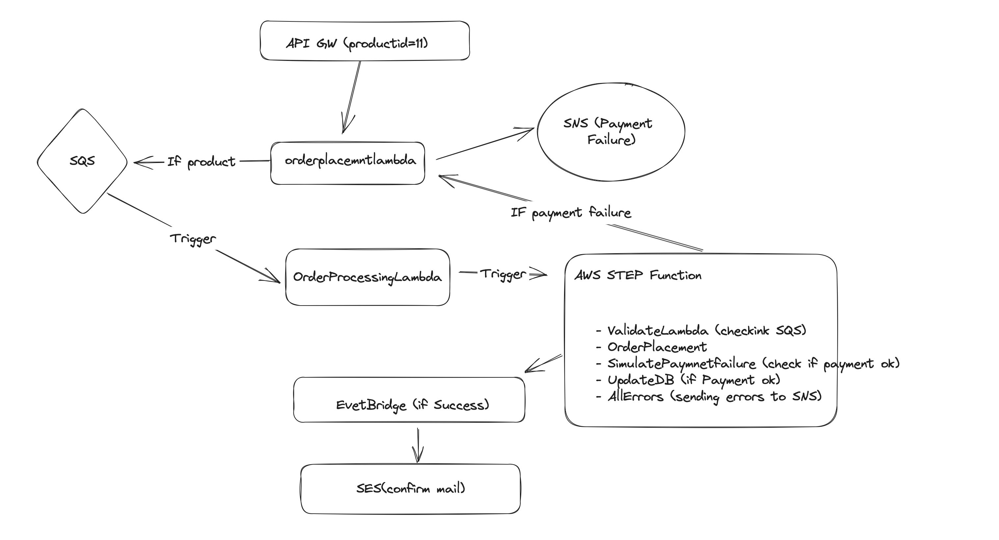

# Order Placement Repository

## Overview

This GitHub repository contains code and configurations for an order placement system. It deploys a CloudFormation stack using GitHub Actions, which includes an API Gateway. The API Gateway URL can be obtained from the CloudFormation output or by checking the GitHub Actions workflow's "Show CloudFormation Stack Outputs" step.

## Testing the System

### Order Placement

To place an order, send a POST request to the API with the following details:
 
- Method: POST
- URL: `/order?productid=XxXxX`
 
If the order is successfully received, the API will respond with:

```json
{
    "statusCode": 200,
    "body": "Message: Order received"
}
```

### Simulating Payment Error

To simulate a payment failure, send a POST request to the API with the following details:

- Method: POST
- URL: `/order?event=payment_failure`
 
This will trigger a payment failure scenario, and the API will respond with:

 
```json
{
    "statusCode": 402,
    "body": "Message: Payment Failure"
}
```


### Diagram

